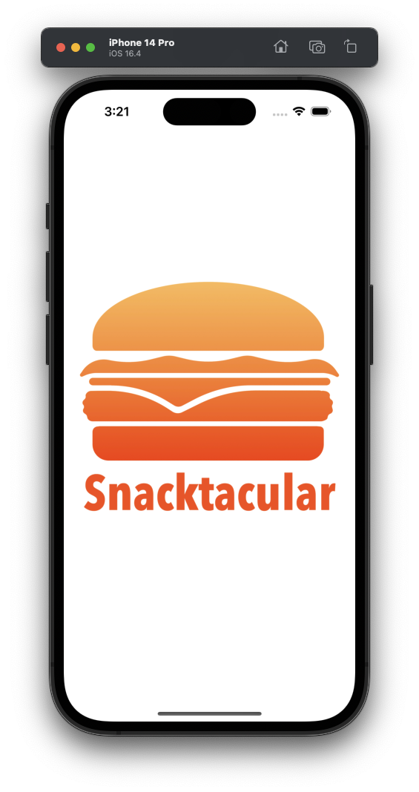
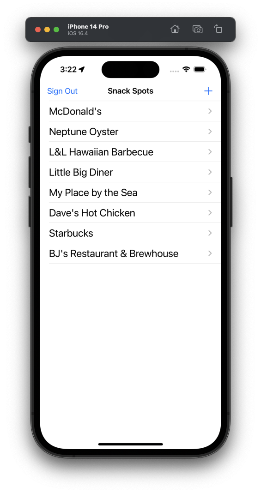
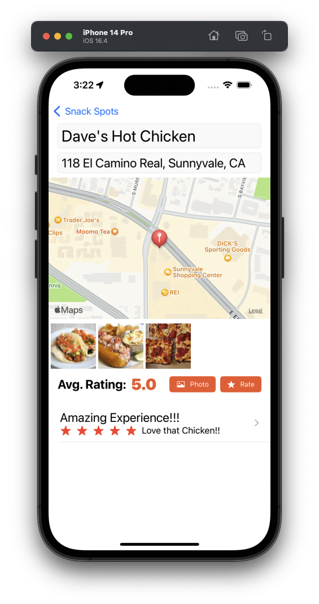

## SnacktacularUI
FullStack Restaurant Review App using GoogleFirebase &amp; CoudFirestore in SwiftUI

- Build the app in MVVM
- Firebase Email & password Signup / Login
- Saving to cloud Firestore
- MapKit and LocationManager
- @FirestoreQuery
- Delete data from Firestore
- Add image with PhotosPicker
- Saving images in Firebase cloud storage

## Screenshots

  
  
  

#### By John Gallaugher
https://bit.ly/prof-g-swiftui
